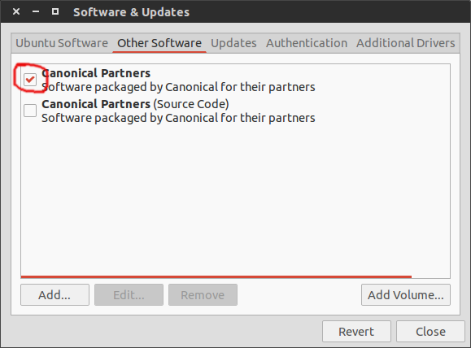

# Ubuntu-post-install
This tips and scripts are used after installation of ubuntu and they simplify process of setting work environment.

## 1. Activate *Canonical partners* repositories
Go to *Software & Updates - Other Software* and check the *Canonical Partners* 


## 2. Drivers installation
Go to *Software & Updates - Additional Drivers* and install needed drivers.
### Check that video driver is installed correctly
Run *glxgears* from *mesa-utils* and check the performance:
```bash
sudo apt-get install mesa-utils
glxgears
```
glxgears shows next results
Videocard | Performance
----------|------------
Nvidia GT 540M | *23889 frames in 5.0 seconds = 4777.690 FPS*
Internal Intel HD | *305 frames in 5.0 seconds = 60.992 FPS*

## 3. Software installation
Run *soft-install.sh* script from this repository and type your password
```bash
chmod +x soft-install.sh
./soft-install
```
This script will **delete** *unity-webapps-common*(Software to integrate webapps to Unity shell). **Adds** *webupd8team/java* and *numix* repositories and **installs** following software:
* htop
* mc
* lynx
* gparted
* ubuntu-restricted-extras
* smplayer
* p7zip-full
* exfat-utils
* fbreader
* gnote 
* gimp
* kamerka
* kazam
* skype
* synaptic
* indicator-multiload
* unity-tweak-tool
* speedcrunch
* artha
* compizconfig-settings-manager
* compiz-plugins
* oracle-java8-installer
* numix-gtk-theme
* numix-icon-theme-circle

After installation of software this script opens firefox with 3 tabs from which you can download and install latest versions of *sublime text*, *Dropbox* and *IntelliJ IDEA*.

## 4. Customize your ubuntu settings
Customize your ubuntu by:
* Changing system settings 
* Disabling web search in dash
* Adding workspaces

## 5. Change look&feel
Add some eye-candy to your system:
* Apply themes by unity-tweak-tool
* Aplly following *Compiz* settings by *CompizConfig Setting Manager*:
  * Enable *Wobbly Windows*
  * Set these animations:
    * Action | Animation
      -------|----------
      Open Animation | Zoom
	  Close Animation | Curved Fold
      Minimize Animation | Horizontal Folds
      Unminimize Animation | Magic Lamp